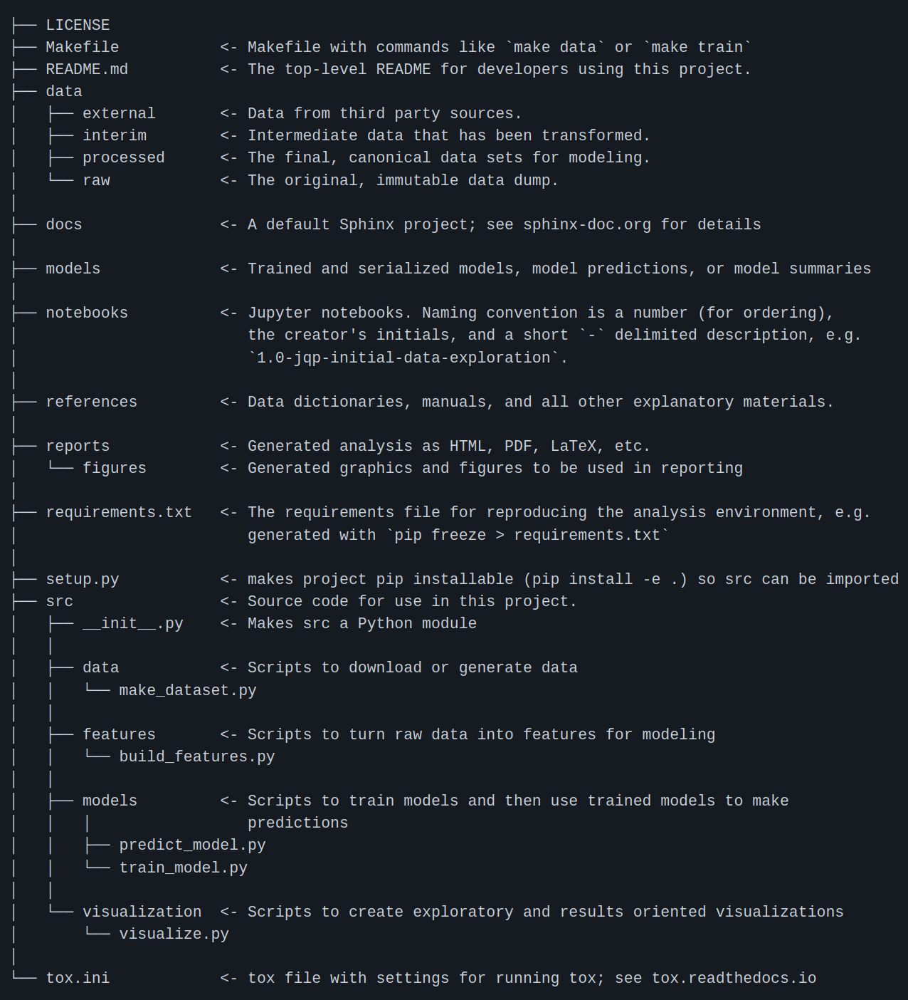

Initiate the project
=====================

Project :

The goal of this project is to apply some concepts & tools seen in the 3 parts of this 

course, this project is organized into 3 parts :

#. : Building Classical ML projects with respect to basic ML Coding best practices
#. : Integrate MLFlow to your project
#. : Integrate ML Interpretability to your project

For this project we will use a dataSet of Home Credit Risk Classification:

'https://www.kaggle.com/c/home-credit-default-risk/data'

..NOTE::

	We don't use all the datasets available on Kaggle but only the main data set :

	application_train.csv

	application_test.csv

We downloaded these CSV files directly in our computer and put them in a data folder. 

For our organization we use a Cookie Cutter template :

